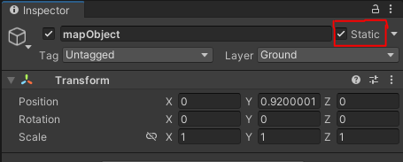

# Unity_ActionRPG
유니티로 ActionRPG(Diable등) 게임 제작하기

지금까지 유니티를 개인적으로 공부해왔지만, 하나같이 프로젝트를 직접 만들어보면서 해본것이라 간단한 컴포넌트 조차 제대로 짚고 넘어갈 기회가 없었다.
예를들어 rigidbody컴포넌트는 그동안 셀수없이 써봤지만 그 안에 Is Kinematic같은것은 정확히 어떤역할을 하는지 몰랐다.
이 참에 그동안 간과했던 하나하나 짚고 여기에 적어보려 한다.

__프로젝트 설명__에는 프로젝트를 만들면서 사용한 기술, 코드의 큰 맥락등을 분석한것을 적을것이며, 
__공부내용.__에는 내가 그동안 무심코 지나치며 적용했던 것들을 적어보며 복습한다.

## 프로젝트 설명

움직임은 rigidbody를 사용한다. 
rigidbody에 설명은 아래 (새로이 알게된것 -> 2.rigidbody 컴포넌트 구성을 알아보자) 참조.

## 공부내용.

1. 정적 오브젝트

ground 와 같이 움직이지 않는것들은 static을 표기해주는 것이 좋다. 이는 정적 오브젝트가 포지션 변화로 인해 무효화 될일이 없다는것을 체크해주는것으로,
여러 정적 오브젝트들을 배치(batch) 라는 하나의 큰 오브젝트로 결합시킴으로서 렌더링을 최적화 할수 있다.(정적 최적화)
필요에 따라 static옆에 화살표를 눌러 원하는 정적 상태를 (활성화/비활성화) 시킬수 있다. 이는 아래 링크 참조.

[정적 게임 오브젝트, 정적 설정에 대한 설명](https://docs.unity3d.com/kr/530/Manual/StaticObjects.html)

---
2. rigidbody 컴포넌트 구성을 알아보자

> rigidbody : gameobject를 물리엔진에서 제어하도록 만드는 컴포넌트이다.

- Mass : 질량이다. rigidbody끼리 충돌할때 작용하는 요소이다.

- Drag : 공기저항값이다. 값이 크면 깃털과 같이 가볍게 작용해 점프등을 할때 천천히 내려옴.

- Angular Drag : 회전을 할떄의 저항값이다.

- Use Gravity : 중력을 받을것인가

- is Kinematic : 물리엔진이 아닌 GameObject에서 짜준 로직에 따라서 이동을 해줄것인가. (즉 이것을 체크하면 외부에서 가해지는 물리적 힘에 반응하지 않는다.
보통 AddForce등과같은 물리거동을 사용하지 않는경우에는 충돌, 힘이 적용될때만 이것을 해제해주기도 한다.)

- Interpolate : 물리엔진에서의 애니메이션을 자연스레 보관을 할것인가.
~ None - Interpolate 기능을 사용하지 않는다
~ Interpolate - 이전 프레임을 기반으로 보정하여 움직임을 보정한다.
~ Extrapolate - 다음 프레임의 움직임을 추정해서 움직임을 보정한다.

- Collision Detection : 충돌감지를 설정해준다.
~ Discrete : 일반적인 충돌 감지 방식으로 모든 collider와의 충돌을 검사하여 감지한다.
~ Continuous : 배경이나 Static 등 고정되어있는 것과의 충돌을 인식할때 사용된다.
~ Continuous Dynamic : 위의 두 방식을 번갈아 사용하면서 충돌을 인식한다.
~ Continuous Speculative : Continuous Dynamic 보다 성능적으로 가볍다. 다만, 실제로 충돌을 하지 않았지만 두 물체가 충돌했다고 인식하는 경우가 발생할 수 있다고 한다.

-Constraints : rigidbody의 움직임을 제어한다.

---
3. '#'region, '#'endregion

보통 '#'region Name 
(내용작성)
'#' endregion

과같이 사용한다. 이는 비슷한 코드끼리 묶어 가동성을 높이기 위해 쓰는 역할이다.(코드 접기가 가능)
성능 및 기능상의 이점은 없다.